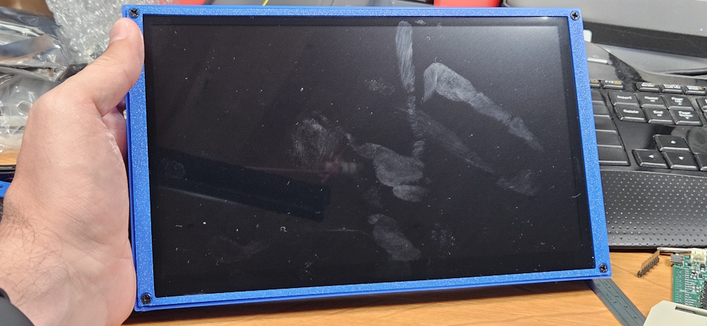
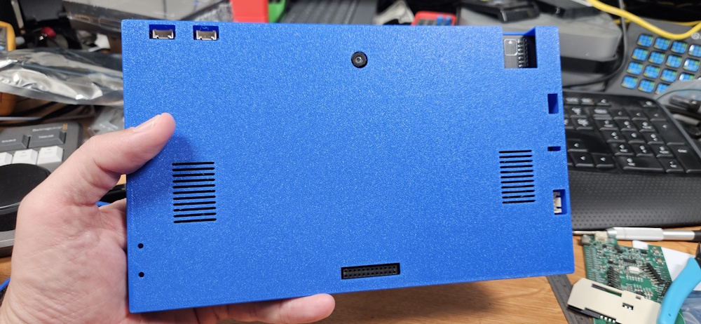

# CrowPanel Advanced 10.1" Enclosure

Custom enclosure for the Elecrow CrowPanel Advanced 10.1" ESP32-P4 HMI AI display
(1024 x 600 IPS touch screen, WiFi 6).

## Files

- `10_1_case.FCStd` - FreeCAD source for the full enclosure
- `10_1_case-Case.3mf` - main case body
- `10_1_case-front_frame.3mf` - front frame

The two 3MF files are derived from the FreeCAD model.

## Assembly

The enclosure is held together with 4x M3 x 16 mm self-tapping screws.

## Notes

- All rear ports are currently exposed.
- A variant with the rear ports closed can be added later if needed.
