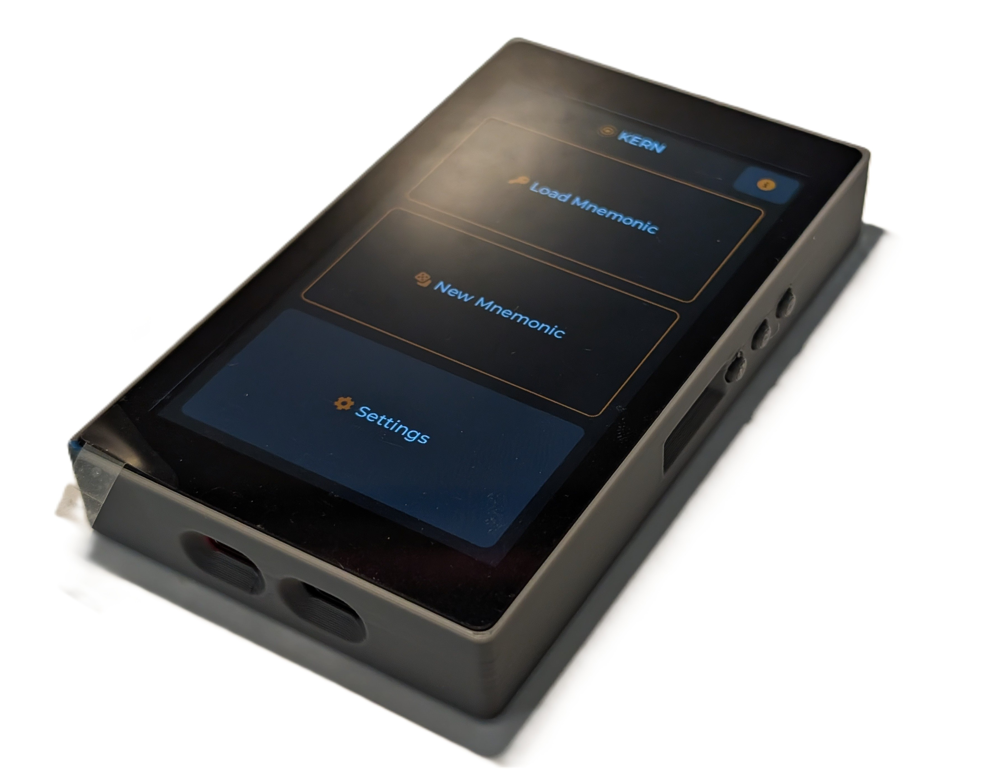
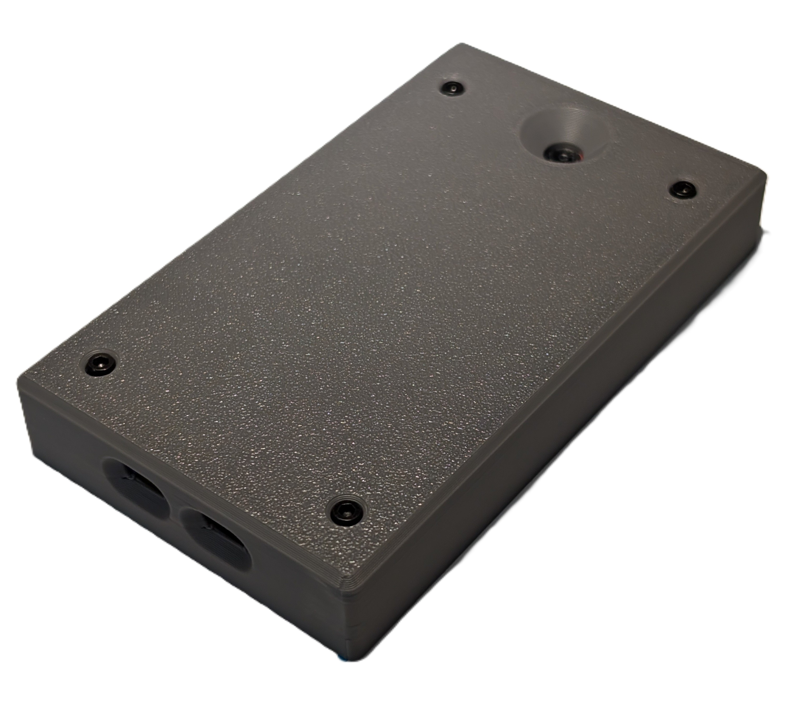
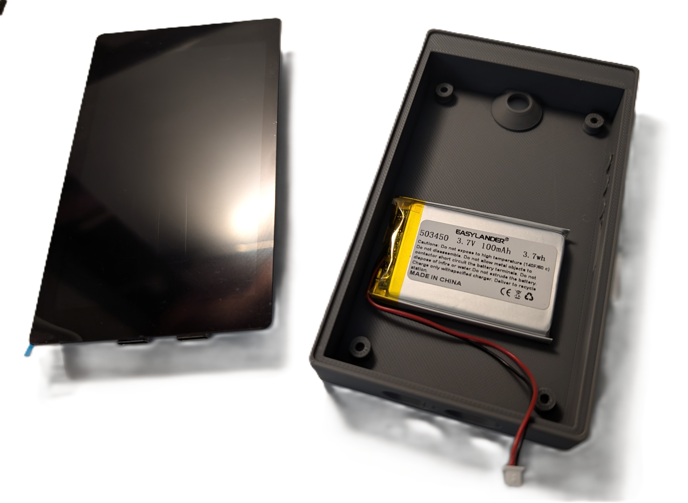

# Waveshare 4.3" Enclosure

A 3D-printable enclosure for the [Waveshare ESP32-P4-WiFi6-Touch-LCD-4.3](https://www.waveshare.com/esp32-p4-wifi6-touch-lcd-4.3.htm) development board (480x800 LCD).

## Files

| File | Description |
|---|---|
| KernWaveshare4.3.FCStd | Main FreeCAD source file |
| KernWaveshare4.3AlanKeyVariant.FCStd | Variant with hex socket head screw mounting |
| KernWaveshare4.3.3mf | Ready-to-slice 3D models |
| Button.FCStd | Separate button component |

## Printing

- **Material:** PLA
- **Layer height:** 0.2 mm
- **Infill:** 15% cross hatch
- **Orientation:** Print as designed (flat on build plate)

## Assembly

- Battery taped to inside of enclosure (optional — the board can also run off USB power)
- Mount the board using **M2.5 screws** (6 mm - 8 mm length recommended)
- The enclosure has an outer protective rim that frames the 4.3" screen
- A **1000mAh battery** (model 503450, [available on AliExpress](https://aliexpress.com/item/1005008707394961.html)) fits snug inside. Note: the units received were mislabeled as "100mAh" in the photos, but they are actually 1000mAh. The battery uses an **MX1.25 connector**, which matches the development board's battery connector. No rewiring needed.

